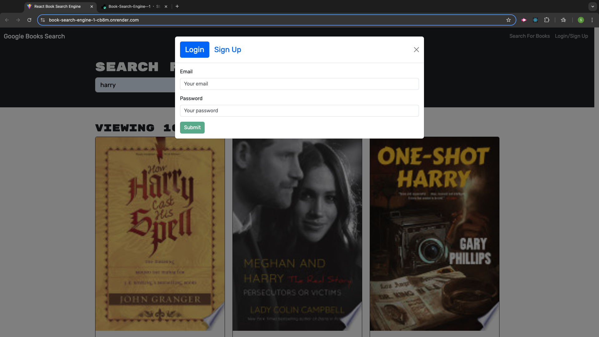
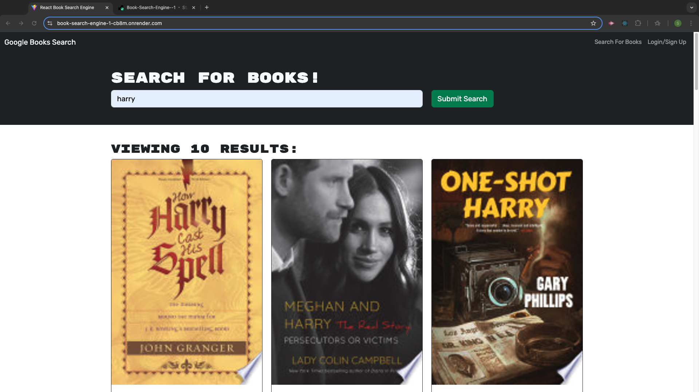
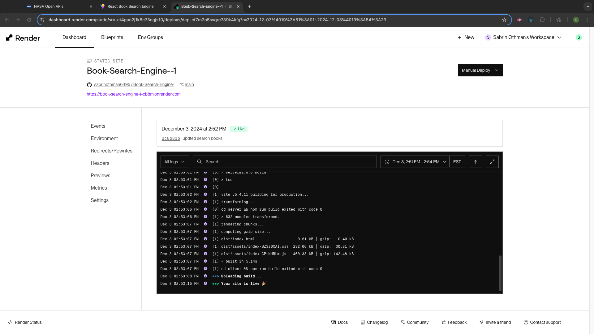

# MERN Book Search Engine
A web application where users can search for books, save them to their personal collection, and view their saved books. The app is built using the MERN stack (MongoDB, Express.js, React, Node.js) and is refactored to use GraphQL for handling queries and mutations.

## Features
* Search for Books: Users can search for books using the Google Books API, which returns a list of books matching the search term.
* Save Books: Users can save books to their personal collection, which is stored in a MongoDB database.
* View Saved Books: Users can view their saved books and remove books from their collection.
* Authentication: Users can sign up and log in to manage their saved books. The app uses JWT (JSON Web Token) for authentication.

## Technologies Used
* Frontend:
     * React
     * Apollo Client (for GraphQL communication)
     * CSS/HTML (for styling)
* Backend:
    * Node.js with Express.js
    * Apollo Server (for GraphQL)
    * MongoDB (for database)
    * JWT (for authentication)
* Other:
    * Google Books API
    * Apollo Server with Express.js integration
    * MongoDB Compass (for cloud database)
## Installation
### Prerequisites
Make sure you have the following installed:

* Node.js
* MongoDB Atlas account
* Apollo Client
* Apollo Server

## Deployment
https://book-search-engine-1-cb8m.onrender.com

## Contact
For any inquiries or issues, please feel free to reach out:

* Email: sabrinothman95@gmail.com
* GitHub: https://github.com/sabrinothman6495